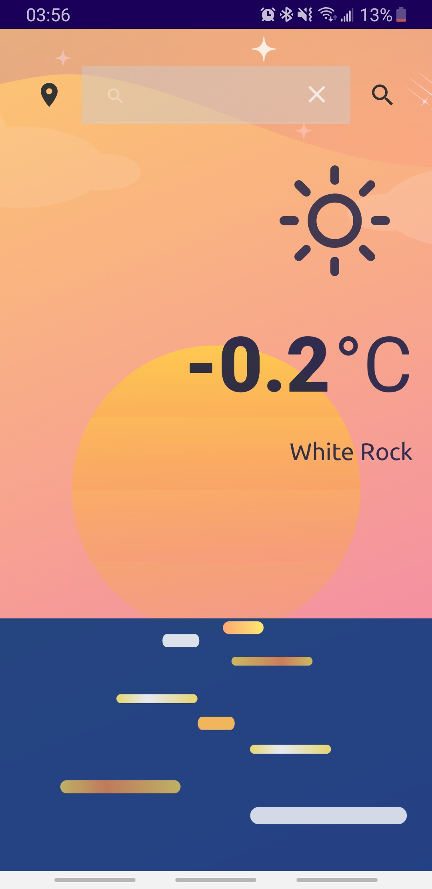

# weatherful 

An Android weather app created using Kotlin and Retrofit, retrieving data from OpenWeather.
Users can search for a city by typing in the name, or pressing the location icon to get the weather at their current location.

 
## In progress:

* Change background depending on time of day
* Add sunrise/sunset times
* Further organize code
